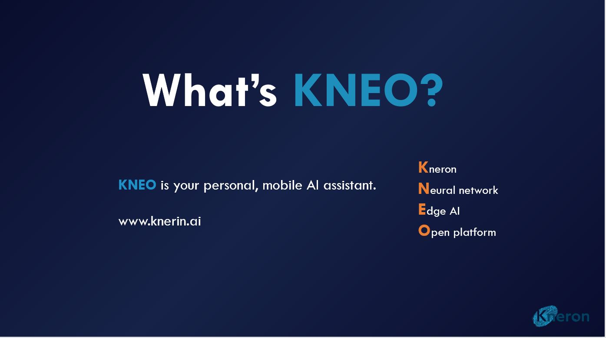
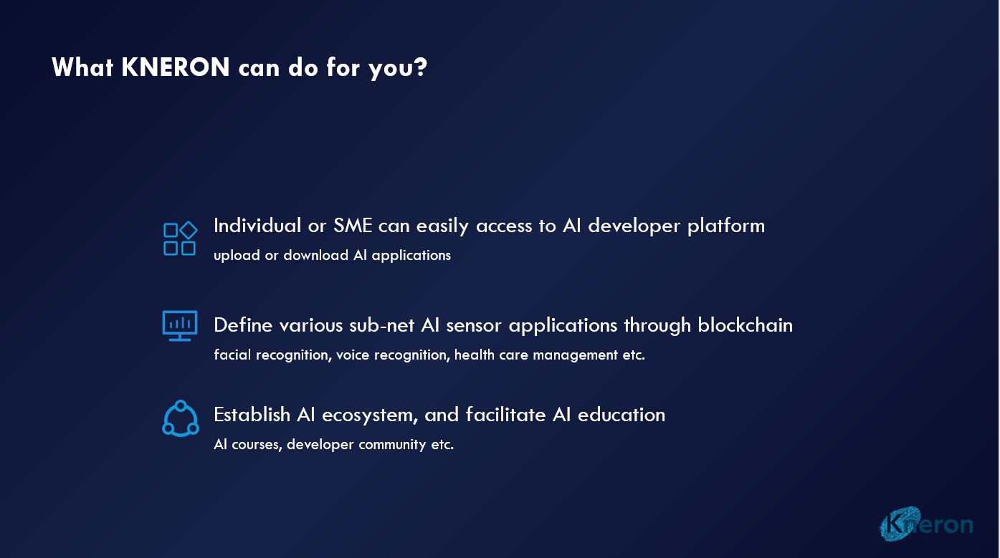
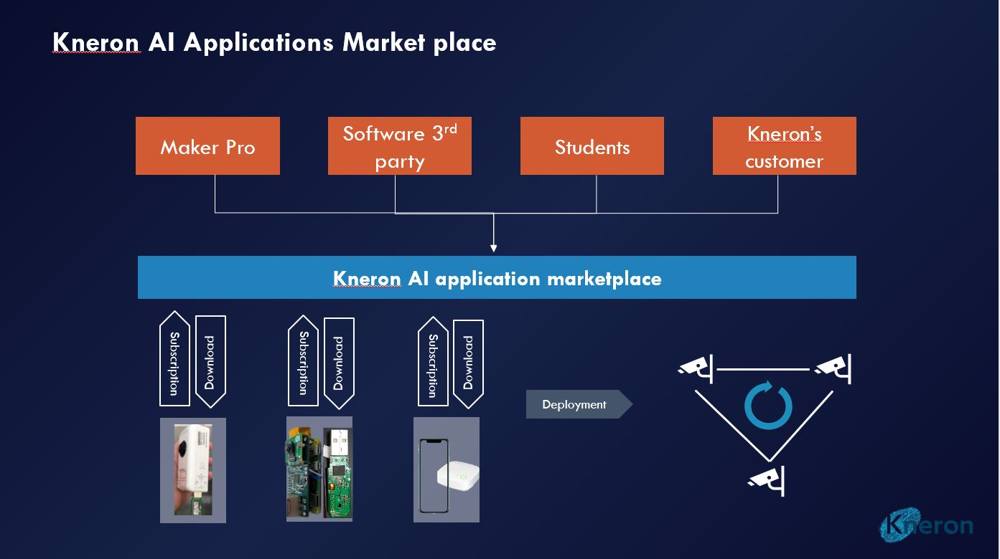

# Kneron Host Lib

This project contains python examples for Kneron USB dongle

This is a brief introduction. For more detailed documents, please visit <http://doc.kneron.com/pythondocs>.

Only support **KL520** so far, other models are coming soon.

## Install Host Lib Python Package

### Prerequisites

**General**:

* Python 3.8  
   * Some system may have python 2.7 as their default python. In that case, you need to use replace 'python' with 'python3' , 'pip' with 'pip3'  in the following examples.  
* opencv-python (Install using `pip install opencv-python`)
   * on raspberry pi,  using `pip3 install opencv-python==3.4.6.27` and if you have other version of opencv-python installed, please run `pip3 uninstall opencv-python`to uninstall them first

**Linux**:

* libusb (Ubuntu install using `apt install libusb-1.0-0-dev`)

**Windows**:

* WinUSB (Install after plugging in the dongle and run [Zadig](https://zadig.akeo.ie/))


* MINGW64/MSYS or PowerShell
    * MSYS
    ```bash
        pacman -S python3-pip  # restart MSYS after installation
        pacman -S mingw-w64-x86_64-opencv
        pacman -S mingw-w64-x86_64-python-numpy
    ```

    * PowerShell: run as administrator

**Mac OS**:

* **Mac OS should be later than 10.15.6**.
* libusb (Install with [Homebrew](https://brew.sh/) using `brew install libusb`)

### Installation

Simply run the following command but replace the item within `<>` .

```bash
pip install python/packages/kdp_host_api-<version>_<os_version>_-py3-none-any.whl
```

`os_version` should be `win`, `mac`, `Raspbian` or`linux`.

Please check the `python/packages` folder for the `version` available.

Extra steps for MSYS
```bash
python -m site # check sys.path
pip install -t <site-packages_relative_path_in_sys.path> python/packages/kdp_host_api-<version>_<os_version>_-py3-none-any.whl
#example: pip install -t /mingw64/lib/python3.8/site-packages python/packages/kdp_host_api-1.1.3_win_-py3-none-any.whl
```

### Troubleshooting

**If the the `.whl` can not be installed and reporting error `File is not a zip file`, please use `git-lfs pull` to fetch the pacakge.**

## Run examples

### Getting started with help

1. **Please make sure you have installed the packages mentioned in the previous section.**
2. Plug in the dongle.
3. Using command line tool and enter the `python` folder.
4. Run `python main.py -h`

If all of the packages are installed correctly, you would get a message with available examples like the following:

```
usage: main.py [-h]
               [-t {KL520-cam_dme_async_post_host_yolo,KL520-cam_dme_serial_post_host_ssd_fd,KL520-cam_dme_serial_post_host_yolo,KL520-cam_dme_serial_ssd_fd,KL520-cam_isi_async_parallel_post_host_yolo,KL520-cam_isi_async_parallel_yolo,KL520-cam_isi_async_ssd_fd,KL520-cam_isi_async_yolo,KL520-cam_isi_serial_yolo,KL520-dme_keras,KL520-get_crc,KL520-get_kn_num,KL520-get_model_info,KL520-get_nef_model_metadata,KL520-soft_reset,KL520-update_app_nef_model,KL520-update_fw}]

Run Python examples by calling the Python APIs

optional arguments:
  -h, --help            show this help message and exit
  -t {KL520-cam_dme_async_post_host_yolo,KL520-cam_dme_serial_post_host_ssd_fd,KL520-cam_dme_serial_post_host_yolo,KL520-cam_dme_serial_ssd_fd,KL520-cam_isi_async_parallel_post_host_yolo,KL520-cam_isi_async_parallel_yolo,KL520-cam_isi_async_ssd_fd,KL520-cam_isi_async_yolo,KL520-cam_isi_serial_yolo,KL520-dme_keras,KL520-get_crc,KL520-get_kn_num,KL520-get_model_info,KL520-get_nef_model_metadata,KL520-soft_reset,KL520-update_app_nef_model,KL520-update_fw}, --task_name {KL520-cam_dme_async_post_host_yolo,KL520-cam_dme_serial_post_host_ssd_fd,KL520-cam_dme_serial_post_host_yolo,KL520-cam_dme_serial_ssd_fd,KL520-cam_isi_async_parallel_post_host_yolo,KL520-cam_isi_async_parallel_yolo,KL520-cam_isi_async_ssd_fd,KL520-cam_isi_async_yolo,KL520-cam_isi_serial_yolo,KL520-dme_keras,KL520-get_crc,KL520-get_kn_num,KL520-get_model_info,KL520-get_nef_model_metadata,KL520-soft_reset,KL520-update_app_nef_model,KL520-update_fw}
                        KL520-cam_dme_async_post_host_yolo
                        KL520-cam_dme_serial_post_host_ssd_fd
                        KL520-cam_dme_serial_post_host_yolo
                        KL520-cam_dme_serial_ssd_fd
                        KL520-cam_isi_async_parallel_post_host_yolo
                        KL520-cam_isi_async_parallel_yolo
                        KL520-cam_isi_async_ssd_fd
                        KL520-cam_isi_async_yolo
                        KL520-cam_isi_serial_yolo
                        KL520-dme_keras
                        KL520-get_crc
                        KL520-get_kn_num
                        KL520-get_model_info
                        KL520-get_nef_model_metadata
                        KL520-soft_reset
                        KL520-update_app_nef_model
                        KL520-update_fw
```

### Run Examples

There are two kinds of examples, need `update_app_nef_model` and don't need extra steps.

**If this is the first time you are using a dongle, please run `update_app_nef_model` to update the firmware and nef model.**
Just follow the steps below to update `tiny_yolo_v3` into the dongle and update the firmware and nef model.

1. Copy all files under `input_models/KL520/tiny_yolo_v3` and `app_binaries/KL520/tiny_yolo_v3` into `app_binaries/KL520/ota/ready_to_load`.
2. Enter `python` directory.
3. Run `python main.py -t update_app_nef_model` (This step may take some time).

> If you have errors related to adding device failure, please check your permission. If on Linux, please try using `sudo`.

#### Examples need `update_app_nef_model`

Most examples need extra steps to upload the model file into the dongle. You can find the model files under `input_models/KL520`. Here is a table of the relationship between models and examples:

| Example                      | Model and Firmware |
|------------------------------|--------------|
| KL520-cam_dme_serial_ssd_fd  | ssd_fd_lm    |
| KL520-cam_isi_async_ssd_fd   | ssd_fd_lm    |
| KL520-cam_isi_serial_yolo    | tiny_yolo_v3 |
| KL520-cam_isi_async_yolo     | tiny_yolo_v3 |
| KL520-cam_isi_async_parallel_yolo | tiny_yolo_v3 |
| KL520-cam_isi_async_parallel_post_host_yolo | tiny_yolo_v3 |

Here are the steps you need to update the dongle and run the example. Let's take `KL520-cam_isi_async_yolo` as the example.

1. From the chart, we know we need to use model and firmware of `tiny_yolo_v3`.
2. Copy all files under `input_models/KL520/tiny_yolo_v3` and `app_binaries/KL520/tiny_yolo_v3` into `app_binaries/KL520/ota/ready_to_load`.
3. Enter `python` directory.
4. Run `python main.py -t KL520-update_app_nef_model` (This step may take some time).
5. Run `python main.py -t KL520-cam_isi_async_yolo`.

Now, you can get a window pop up and running your test. Congratulations!

To stop the test and quit, just press `q` when focusing on the command line.

#### No Extra Step Example

Let's try the example do not need extra steps: `KL520-dme_keras`.

You just need to run the command `python main.py -t KL520-dme_keras` with your dongle plugged in. Then, you can get the output without any error message.

```bash
$ python main.py -t KL520-dme_keras
adding devices....

start kdp host lib....

Task:  KL520-dme_keras
loading models to Kneron Device: 
starting DME mode ...

DME mode succeeded...

Model loading successful
starting DME configure ...

DME configure model [18] succeeded...

./data/images/cat.jpg
281 0.5517006780734921
282 0.23251050988507144
285 0.12161772961601827
./data/images/fox.jpg
277 0.8187506998369483
278 0.0760648702786444
272 0.02318463970950107
de init kdp host lib....
```





